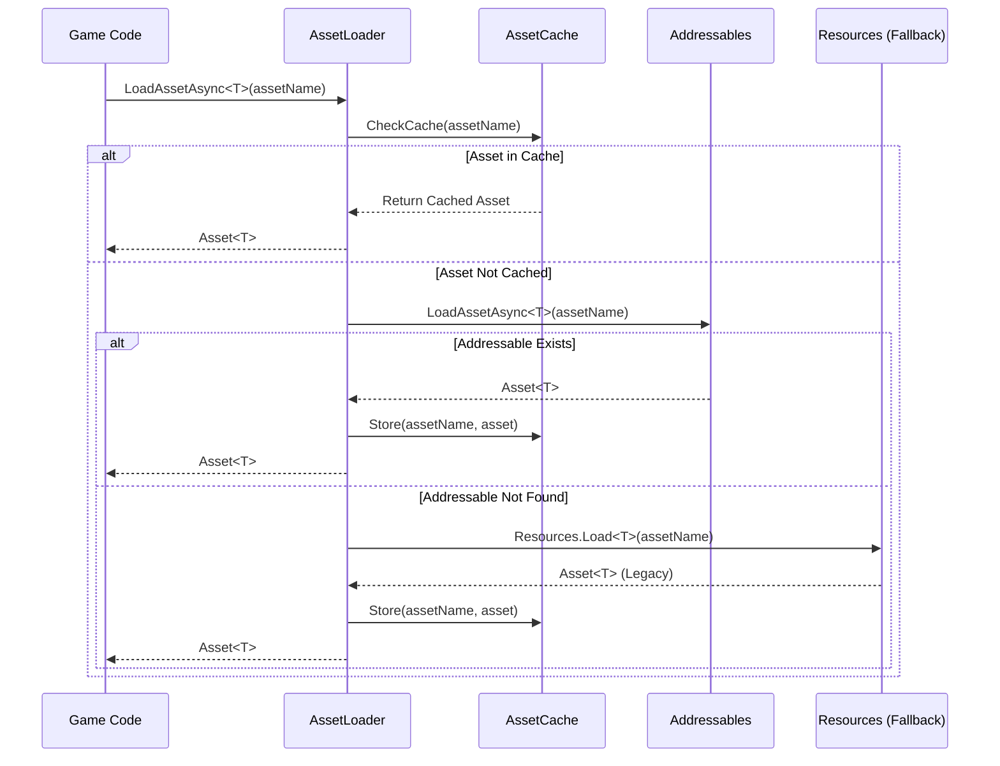

# Design Document: Addressables Migration

## Overview

Поэтапная миграция Unity RPG проекта с Resources.Load на Addressables систему для уменьшения размера начальной загрузки WebGL билдов. Миграция начинается с критичных систем (оружие, броня, предметы) с сохранением обратной совместимости с существующими JSON-сохранениями.

## Main Algorithm/Workflow



## Core Interfaces/Types

```csharp
// Unified asset loading interface
public interface IAssetLoader
{
    Task<T> LoadAssetAsync<T>(string assetName) where T : UnityEngine.Object;
    void ReleaseAsset(string assetName);
    void PreloadAssets<T>(IEnumerable<string> assetNames) where T : UnityEngine.Object;
}

// Asset reference wrapper for save compatibility
[System.Serializable]
public struct AssetReference
{
    public string AssetName;      // Original Resources path (e.g., "Weapons/Sword")
    public string AddressableKey; // Addressables key (e.g., "weapon_sword")
    
    public AssetReference(string assetName)
    {
        AssetName = assetName;
        AddressableKey = ConvertToAddressableKey(assetName);
    }
    
    private static string ConvertToAddressableKey(string resourcesPath)
    {
        // Convert "Weapons/Sword" -> "weapon_sword"
        return resourcesPath.ToLower().Replace("/", "_");
    }
}

// Migration status tracking
public enum MigrationStatus
{
    NotMigrated,      // Still using Resources.Load
    Migrated,         // Using Addressables
    Hybrid            // Both systems available (transition period)
}

// Asset metadata for migration
[System.Serializable]
public class AssetMetadata
{
    public string ResourcesPath;
    public string AddressableKey;
    public string AssetType;
    public bool IsMigrated;
    public long FileSize;
}
```

## Key Functions with Formal Specifications

### Function 1: LoadAssetAsync<T>()

```csharp
public async Task<T> LoadAssetAsync<T>(string assetName) where T : UnityEngine.Object
```

**Preconditions:**
- `assetName` is non-null and non-empty string
- `T` is a valid Unity Object type (ScriptableObject, Prefab, etc.)
- AssetLoader is initialized

**Postconditions:**
- Returns valid asset of type `T` or null if not found
- Asset is cached in memory for subsequent requests
- If Addressables fails, fallback to Resources.Load is attempted
- No exceptions thrown (errors logged internally)

**Loop Invariants:** N/A (async operation, no loops)

### Function 2: RestoreEquipmentState()

```csharp
public async Task RestoreEquipmentState(Dictionary<string, string> savedState)
```

**Preconditions:**
- `savedState` is non-null dictionary
- Dictionary keys follow format: "Weapon", "BodyArmor", "HelmetArmor", etc.
- Dictionary values are valid asset names (Resources paths)

**Postconditions:**
- All equipment items from savedState are loaded and equipped
- Missing assets are logged but don't break restoration
- Equipment state matches saved state after completion
- Compatible with both old (Resources) and new (Addressables) save formats

**Loop Invariants:**
- For each armor slot iteration: Previously processed slots are equipped correctly
- Equipment state remains consistent throughout restoration

### Function 3: MigrateAssetToAddressables()

```csharp
public bool MigrateAssetToAddressables(string resourcesPath, string addressableKey, string label)
```

**Preconditions:**
- `resourcesPath` points to existing asset in Resources folder
- `addressableKey` is unique and follows naming convention
- `label` is valid Addressables group label

**Postconditions:**
- Asset is added to Addressables system with specified key and label
- Asset metadata is recorded in migration manifest
- Original Resources asset remains untouched (backward compatibility)
- Returns true if migration successful, false otherwise

**Loop Invariants:** N/A (single asset operation)

## Algorithmic Pseudocode

### Main Asset Loading Algorithm

```csharp
ALGORITHM LoadAssetAsync<T>(assetName)
INPUT: assetName of type string, T is Unity Object type
OUTPUT: asset of type T or null

BEGIN
  ASSERT assetName != null AND assetName != ""
  
  // Step 1: Check cache first
  IF assetCache.Contains(assetName) THEN
    RETURN assetCache.Get<T>(assetName)
  END IF
  
  // Step 2: Try Addressables first
  TRY
    addressableKey ← ConvertToAddressableKey(assetName)
    asyncOperation ← Addressables.LoadAssetAsync<T>(addressableKey)
    AWAIT asyncOperation
    
    IF asyncOperation.Status = AsyncOperationStatus.Succeeded THEN
      asset ← asyncOperation.Result
      assetCache.Store(assetName, asset)
      RETURN asset
    END IF
  CATCH exception
    LogWarning("Addressables load failed for: " + assetName)
  END TRY
  
  // Step 3: Fallback to Resources.Load
  TRY
    asset ← Resources.Load<T>(assetName)
    IF asset != null THEN
      assetCache.Store(assetName, asset)
      LogInfo("Loaded from Resources (legacy): " + assetName)
      RETURN asset
    END IF
  CATCH exception
    LogError("Failed to load asset: " + assetName)
  END TRY
  
  // Step 4: Asset not found
  RETURN null
END
```

**Preconditions:**
- assetName is valid non-empty string
- Type T is Unity Object-derived type
- AssetLoader is initialized

**Postconditions:**
- Returns valid asset or null
- Asset is cached if successfully loaded
- Errors are logged but not thrown

**Loop Invariants:** N/A (sequential operations)

### Equipment Restoration Algorithm

```csharp
ALGORITHM RestoreEquipmentState(savedState)
INPUT: savedState of type Dictionary<string, string>
OUTPUT: void (side effect: equipment equipped)

BEGIN
  ASSERT savedState != null
  
  // Define equipment slots to restore
  equipmentSlots ← [
    "Weapon", "BodyArmor", "CapeArmor", "HelmetArmor",
    "UpperArmLeftArmor", "UpperArmRightArmor",
    "LowerArmLeftArmor", "LowerArmRightArmor",
    "BootLeftArmor", "BootRightArmor",
    "GloveLeftArmor", "GloveRightArmor", "TrousersArmor"
  ]
  
  // Restore each equipment slot
  FOR each slotName IN equipmentSlots DO
    ASSERT allPreviousSlotsRestored()
    
    IF savedState.ContainsKey(slotName) THEN
      assetName ← savedState[slotName]
      
      // Load asset using unified loader
      asset ← AWAIT LoadAssetAsync<EquipmentConfig>(assetName)
      
      IF asset != null THEN
        EquipItem(slotName, asset)
      ELSE
        LogWarning("Failed to restore equipment: " + slotName)
      END IF
    END IF
  END FOR
  
  ASSERT allEquipmentRestored()
END
```

**Preconditions:**
- savedState dictionary is non-null
- Equipment slot names in savedState match expected format
- LoadAssetAsync is functional

**Postconditions:**
- All available equipment from savedState is equipped
- Missing equipment is logged but doesn't break restoration
- Equipment state is consistent

**Loop Invariants:**
- All previously processed equipment slots are correctly equipped
- Equipment state remains valid throughout iteration

### Asset Migration Algorithm

```csharp
ALGORITHM MigrateAssetBatch(resourcesPaths, addressableGroup, label)
INPUT: resourcesPaths (list of strings), addressableGroup (string), label (string)
OUTPUT: migrationReport (list of AssetMetadata)

BEGIN
  ASSERT resourcesPaths != null AND resourcesPaths.Count > 0
  ASSERT addressableGroup != null AND label != null
  
  migrationReport ← empty list
  successCount ← 0
  failureCount ← 0
  
  // Migrate each asset
  FOR each resourcesPath IN resourcesPaths DO
    ASSERT successCount + failureCount = migrationReport.Count
    
    TRY
      // Step 1: Load asset from Resources
      asset ← Resources.Load(resourcesPath)
      IF asset = null THEN
        LogError("Asset not found: " + resourcesPath)
        failureCount ← failureCount + 1
        CONTINUE
      END IF
      
      // Step 2: Generate Addressable key
      addressableKey ← ConvertToAddressableKey(resourcesPath)
      
      // Step 3: Add to Addressables
      entry ← AddressableAssetSettings.CreateOrMoveEntry(
        asset.GUID,
        addressableGroup
      )
      entry.address ← addressableKey
      entry.labels.Add(label)
      
      // Step 4: Record metadata
      metadata ← new AssetMetadata {
        ResourcesPath = resourcesPath,
        AddressableKey = addressableKey,
        AssetType = asset.GetType().Name,
        IsMigrated = true,
        FileSize = GetAssetFileSize(asset)
      }
      migrationReport.Add(metadata)
      successCount ← successCount + 1
      
    CATCH exception
      LogError("Migration failed for: " + resourcesPath)
      failureCount ← failureCount + 1
    END TRY
  END FOR
  
  ASSERT successCount + failureCount = resourcesPaths.Count
  LogInfo("Migration complete: " + successCount + " succeeded, " + failureCount + " failed")
  
  RETURN migrationReport
END
```

**Preconditions:**
- resourcesPaths contains valid paths to Resources assets
- addressableGroup exists in Addressables settings
- label is valid Addressables label

**Postconditions:**
- All successfully migrated assets are added to Addressables
- Migration metadata is recorded for each asset
- Original Resources assets remain unchanged
- Returns complete migration report

**Loop Invariants:**
- successCount + failureCount equals number of processed assets
- All processed assets have metadata entries in migrationReport
- Addressables system remains in valid state throughout migration

## Example Usage

```csharp
// Example 1: Initialize AssetLoader
public class GameBootstrap : MonoBehaviour
{
    private IAssetLoader assetLoader;
    
    private async void Start()
    {
        // Initialize with hybrid mode (Addressables + Resources fallback)
        assetLoader = new HybridAssetLoader(MigrationStatus.Hybrid);
        await assetLoader.InitializeAsync();
    }
}

// Example 2: Load weapon using unified loader
public class PlayerFighter : MonoBehaviour
{
    [SerializeField] private IAssetLoader assetLoader;
    
    public async Task RestoreState(object state)
    {
        Dictionary<string, string> savedState = (Dictionary<string, string>)state;
        
        // Load weapon
        if (savedState.ContainsKey("Weapon"))
        {
            string weaponName = savedState["Weapon"];
            WeaponConfig weapon = await assetLoader.LoadAssetAsync<WeaponConfig>(weaponName);
            if (weapon != null)
            {
                EquipWeapon(weapon);
            }
        }
        
        // Load armor pieces
        if (savedState.ContainsKey("BodyArmor"))
        {
            string armorName = savedState["BodyArmor"];
            BodyArmorConfig armor = await assetLoader.LoadAssetAsync<BodyArmorConfig>(armorName);
            if (armor != null)
            {
                EquipArmor(armor);
            }
        }
        
        // ... repeat for other armor slots
    }
}

// Example 3: Migrate assets in Editor
#if UNITY_EDITOR
public class AddressablesMigrationTool : EditorWindow
{
    public void MigrateWeaponsAndArmor()
    {
        var migrator = new AssetMigrator();
        
        // Migrate weapons
        var weaponPaths = new List<string>
        {
            "Weapons/Sword",
            "Weapons/Bow",
            "Weapons/Staff"
        };
        migrator.MigrateAssetBatch(weaponPaths, "Equipment", "weapon");
        
        // Migrate armor
        var armorPaths = new List<string>
        {
            "Armor/Body/IronChestplate",
            "Armor/Helmet/IronHelmet"
        };
        migrator.MigrateAssetBatch(armorPaths, "Equipment", "armor");
        
        // Build Addressables content
        AddressableAssetSettings.BuildPlayerContent();
    }
}
#endif

// Example 4: Preload critical assets for WebGL
public class WebGLAssetPreloader : MonoBehaviour
{
    [SerializeField] private IAssetLoader assetLoader;
    [SerializeField] private List<string> criticalAssets;
    
    public async Task PreloadCriticalAssets()
    {
        // Preload only essential assets for initial scene
        var essentialWeapons = new List<string>
        {
            "Weapons/StarterSword",
            "Weapons/Unarmed"
        };
        
        await assetLoader.PreloadAssetsAsync<WeaponConfig>(essentialWeapons);
        
        // Other assets load on-demand
    }
}

// Example 5: Backward compatibility with old saves
public class SaveCompatibilityLayer
{
    public static async Task<WeaponConfig> LoadWeaponFromSave(string savedWeaponName, IAssetLoader loader)
    {
        // Old saves use Resources paths: "Weapons/Sword"
        // New system converts to Addressable keys: "weapon_sword"
        // Loader handles both automatically
        
        WeaponConfig weapon = await loader.LoadAssetAsync<WeaponConfig>(savedWeaponName);
        
        if (weapon == null)
        {
            Debug.LogWarning($"Weapon not found: {savedWeaponName}, using default");
            weapon = await loader.LoadAssetAsync<WeaponConfig>("Weapons/Unarmed");
        }
        
        return weapon;
    }
}
```

## Correctness Properties

### Property 1: Asset Loading Consistency
```csharp
// For any asset name, LoadAssetAsync returns the same asset instance
∀ assetName ∈ ValidAssetNames:
  LoadAssetAsync<T>(assetName) = LoadAssetAsync<T>(assetName)
  
// Cached assets are identical to freshly loaded assets
∀ assetName ∈ CachedAssets:
  cache.Get(assetName) ≡ LoadAssetAsync(assetName)
```

### Property 2: Backward Compatibility
```csharp
// Old saves using Resources paths work with new Addressables system
∀ oldSave ∈ LegacySaves:
  RestoreState(oldSave) succeeds
  
// Asset loaded via Resources path equals asset loaded via Addressable key
∀ asset ∈ MigratedAssets:
  Resources.Load(asset.ResourcesPath) ≡ Addressables.Load(asset.AddressableKey)
```

### Property 3: Fallback Reliability
```csharp
// If Addressables fails, Resources.Load is attempted
∀ assetName ∈ ValidAssetNames:
  (Addressables.Load(assetName) fails) ⟹ (Resources.Load(assetName) attempted)
  
// At least one loading method succeeds for existing assets
∀ asset ∈ ExistingAssets:
  (Addressables.Load(asset) succeeds) ∨ (Resources.Load(asset) succeeds)
```

### Property 4: Equipment Restoration Completeness
```csharp
// All equipment slots in save state are processed
∀ slot ∈ savedState.Keys:
  (slot ∈ EquipmentSlots) ⟹ (LoadAssetAsync(savedState[slot]) called)
  
// Successfully loaded equipment is equipped
∀ slot ∈ EquipmentSlots:
  (LoadAssetAsync(savedState[slot]) returns asset) ⟹ (asset is equipped)
```

### Property 5: Migration Idempotency
```csharp
// Migrating the same asset twice produces same result
∀ asset ∈ Assets:
  MigrateAsset(asset) = MigrateAsset(MigrateAsset(asset))
  
// Migration preserves asset identity
∀ asset ∈ Assets:
  Resources.Load(asset.path).GetInstanceID() = 
  Addressables.Load(MigrateAsset(asset).key).GetInstanceID()
```

### Property 6: WebGL Load Size Reduction
```csharp
// Initial bundle size is smaller than full Resources build
InitialBundleSize(Addressables) < InitialBundleSize(Resources)

// Total downloaded size converges to same amount after full gameplay
∀ session ∈ CompleteSessions:
  TotalDownloaded(Addressables, session) ≈ TotalDownloaded(Resources, session)
```

## Error Handling

### Error Scenario 1: Addressables Asset Not Found

**Condition**: Addressable key doesn't exist in built content catalog
**Response**: 
- Log warning with asset name and key
- Attempt fallback to Resources.Load with original path
- If Resources also fails, return null and log error
**Recovery**: 
- Game continues with missing asset (e.g., default weapon equipped)
- Error reported to analytics for migration tracking

### Error Scenario 2: Corrupted Save Data

**Condition**: Save file contains invalid asset names or corrupted equipment data
**Response**:
- Validate each asset name before loading
- Skip invalid entries with warning logs
- Continue restoration with valid entries
**Recovery**:
- Player retains partially restored equipment
- Missing equipment slots remain empty (can be re-equipped)

### Error Scenario 3: Addressables Initialization Failure

**Condition**: Addressables system fails to initialize (network error, corrupted catalog)
**Response**:
- Catch initialization exception
- Fall back to Resources-only mode
- Display warning to player about potential longer load times
**Recovery**:
- Game runs entirely on Resources.Load (legacy mode)
- Retry Addressables initialization on next game start

### Error Scenario 4: WebGL Network Timeout

**Condition**: Asset bundle download times out on slow connection
**Response**:
- Implement retry logic with exponential backoff
- Show loading progress to player
- After max retries, fall back to Resources if available
**Recovery**:
- Player can continue with cached/Resources assets
- Background retry continues for failed bundles

### Error Scenario 5: Memory Pressure on WebGL

**Condition**: Too many assets loaded simultaneously causing memory issues
**Response**:
- Implement asset reference counting
- Automatically release unused assets when memory threshold reached
- Prioritize critical assets (equipped items, current scene)
**Recovery**:
- Non-critical assets unloaded and reloaded on-demand
- Game performance maintained

## Testing Strategy

### Unit Testing Approach

**Test Coverage Goals**: 80%+ for core loading logic

**Key Test Cases**:
1. **AssetLoader Tests**:
   - LoadAssetAsync returns correct asset type
   - Cache hit returns same instance
   - Null/empty asset names handled gracefully
   - Addressables failure triggers Resources fallback

2. **Equipment Restoration Tests**:
   - All equipment slots restored from valid save
   - Missing assets don't break restoration
   - Empty save state handled correctly
   - Mixed old/new save formats work

3. **Migration Tests**:
   - Asset successfully added to Addressables
   - Metadata correctly recorded
   - Duplicate migrations handled
   - Invalid paths rejected

**Mocking Strategy**:
- Mock Addressables API for deterministic testing
- Mock Resources.Load for controlled asset loading
- Use test ScriptableObjects for equipment configs

### Property-Based Testing Approach

**Property Test Library**: NUnit with custom property generators

**Properties to Test**:

1. **Load Consistency Property**:
```csharp
[Property]
public void LoadAssetAsync_SameNameReturnsSameAsset(string assetName)
{
    Assume.That(IsValidAssetName(assetName));
    
    var asset1 = await loader.LoadAssetAsync<TestAsset>(assetName);
    var asset2 = await loader.LoadAssetAsync<TestAsset>(assetName);
    
    Assert.That(asset1, Is.SameAs(asset2));
}
```

2. **Fallback Reliability Property**:
```csharp
[Property]
public void LoadAssetAsync_AddressablesFailTriggersResourcesFallback(string assetName)
{
    Assume.That(IsValidAssetName(assetName));
    
    // Force Addressables to fail
    addressablesMock.Setup(a => a.LoadAssetAsync(It.IsAny<string>()))
        .Throws<Exception>();
    
    var asset = await loader.LoadAssetAsync<TestAsset>(assetName);
    
    // Verify Resources.Load was called
    resourcesMock.Verify(r => r.Load<TestAsset>(assetName), Times.Once);
}
```

3. **Equipment Restoration Completeness Property**:
```csharp
[Property]
public void RestoreEquipmentState_AllSlotsProcessed(Dictionary<string, string> saveState)
{
    Assume.That(saveState != null);
    Assume.That(saveState.Keys.All(k => IsValidEquipmentSlot(k)));
    
    await fighter.RestoreEquipmentState(saveState);
    
    // Verify LoadAssetAsync called for each slot
    foreach (var slot in saveState.Keys)
    {
        loaderMock.Verify(l => l.LoadAssetAsync<EquipmentConfig>(saveState[slot]), Times.Once);
    }
}
```

### Integration Testing Approach

**Integration Test Scenarios**:

1. **End-to-End Save/Load Cycle**:
   - Equip various weapons and armor
   - Save game state
   - Clear scene
   - Load game state
   - Verify all equipment restored correctly

2. **Addressables + Resources Hybrid Mode**:
   - Migrate subset of assets to Addressables
   - Load migrated assets (should use Addressables)
   - Load non-migrated assets (should use Resources)
   - Verify correct loading path for each

3. **WebGL Build Integration**:
   - Build WebGL with Addressables
   - Test asset loading in browser environment
   - Verify bundle sizes reduced
   - Test network failure scenarios

4. **Yandex SDK Integration**:
   - Initialize Yandex SDK
   - Load game with Addressables
   - Save/load with Yandex cloud saves
   - Verify compatibility

**Test Environment**:
- Unity Test Framework (PlayMode tests)
- WebGL test builds deployed to local server
- Automated browser testing with Selenium

## Performance Considerations

### WebGL Initial Load Optimization

**Problem**: Resources.Load includes all assets in initial bundle, causing long load times

**Solution**:
- Addressables loads only essential assets initially
- Non-critical assets loaded on-demand
- Target: 50-70% reduction in initial bundle size

**Metrics**:
- Initial bundle size: < 20MB (down from 40-50MB)
- Time to interactive: < 10 seconds on 10Mbps connection
- First scene load: < 5 seconds

### Asset Caching Strategy

**Memory Budget**: 
- WebGL: 100-150MB for asset cache
- Desktop: 500MB+ for asset cache

**Cache Policy**:
- LRU (Least Recently Used) eviction
- Pin critical assets (player equipment, current scene)
- Preload next scene assets during gameplay

**Implementation**:
```csharp
public class AssetCache
{
    private Dictionary<string, CachedAsset> cache;
    private LinkedList<string> lruList;
    private long currentMemoryUsage;
    private long maxMemoryUsage;
    
    public void EvictLRU()
    {
        while (currentMemoryUsage > maxMemoryUsage && lruList.Count > 0)
        {
            var oldestKey = lruList.First.Value;
            var asset = cache[oldestKey];
            
            if (!asset.IsPinned)
            {
                ReleaseAsset(oldestKey);
                lruList.RemoveFirst();
            }
        }
    }
}
```

### Async Loading Performance

**Challenge**: Avoid frame drops during asset loading

**Solution**:
- Use async/await for all asset loading
- Spread loading across multiple frames
- Show loading indicators for long operations

**Best Practices**:
```csharp
// Good: Non-blocking async load
public async Task LoadEquipment()
{
    var weapon = await assetLoader.LoadAssetAsync<WeaponConfig>("Weapons/Sword");
    EquipWeapon(weapon);
}

// Bad: Blocking synchronous load
public void LoadEquipment()
{
    var weapon = Resources.Load<WeaponConfig>("Weapons/Sword"); // Blocks frame
    EquipWeapon(weapon);
}
```

### Bundle Size Optimization

**Addressables Groups Strategy**:
- **Critical Group**: Player equipment, UI, core systems (always loaded)
- **Scene Group**: Assets per scene (loaded on scene transition)
- **Optional Group**: Cosmetics, rare items (loaded on-demand)

**Compression**:
- LZ4 compression for fast decompression (WebGL priority)
- Bundle size target: < 5MB per bundle

## Security Considerations

### Asset Integrity

**Threat**: Malicious asset bundles injected or modified

**Mitigation**:
- Use Addressables content catalog hash verification
- Serve bundles over HTTPS only
- Implement bundle signature verification for critical assets

**Implementation**:
```csharp
public class SecureAssetLoader : IAssetLoader
{
    public async Task<T> LoadAssetAsync<T>(string assetName) where T : UnityEngine.Object
    {
        var handle = Addressables.LoadAssetAsync<T>(assetName);
        await handle.Task;
        
        // Verify asset integrity
        if (!VerifyAssetHash(handle.Result))
        {
            Debug.LogError($"Asset integrity check failed: {assetName}");
            Addressables.Release(handle);
            return null;
        }
        
        return handle.Result;
    }
}
```

### Save Data Validation

**Threat**: Corrupted or malicious save data loading invalid assets

**Mitigation**:
- Validate asset names against whitelist
- Sanitize save data before loading
- Implement save file versioning

**Implementation**:
```csharp
public class SaveValidator
{
    private HashSet<string> validAssetNames;
    
    public bool ValidateEquipmentSave(Dictionary<string, string> saveState)
    {
        foreach (var kvp in saveState)
        {
            // Validate slot name
            if (!IsValidEquipmentSlot(kvp.Key))
            {
                Debug.LogWarning($"Invalid equipment slot: {kvp.Key}");
                return false;
            }
            
            // Validate asset name
            if (!validAssetNames.Contains(kvp.Value))
            {
                Debug.LogWarning($"Invalid asset name: {kvp.Value}");
                return false;
            }
        }
        
        return true;
    }
}
```

### WebGL Specific Security

**Considerations**:
- Asset bundles served from CDN (Yandex CDN)
- CORS configuration for asset loading
- Rate limiting for asset requests

**Yandex SDK Integration**:
```csharp
#if UNITY_WEBGL && !UNITY_EDITOR
public class YandexAddressablesConfig
{
    public static void ConfigureAddressables()
    {
        // Use Yandex CDN for asset bundles
        var settings = AddressableAssetSettingsDefaultObject.Settings;
        settings.BuildRemoteCatalog = true;
        settings.RemoteCatalogBuildPath = "https://cdn.yandex.net/game-assets/";
        settings.RemoteCatalogLoadPath = "https://cdn.yandex.net/game-assets/";
    }
}
#endif
```

## Dependencies

### Unity Packages
- **Addressables** (com.unity.addressables): 1.21.0+
- **Newtonsoft.Json**: 3.2.1 (already in project for save system)
- **Unity Test Framework**: 1.1.33+ (for testing)

### External SDKs
- **Yandex Games SDK**: Current version in project
  - Integration point: Asset bundle hosting on Yandex CDN
  - Save system compatibility maintained

### Project Dependencies
- **Existing Save System** (GameDevTV.Saving):
  - ISaveable interface
  - SavingSystem component
  - JSON serialization with Newtonsoft.Json

- **Equipment System**:
  - WeaponConfig, BodyArmorConfig, and other armor ScriptableObjects
  - PlayerFighter.RestoreState() method
  - Equipment equipping logic

- **Inventory System** (GameDevTV.Inventories):
  - InventoryItem base class
  - InventoryItem.GetFromID() static method
  - Item lookup cache

- **Quest System**:
  - Quest ScriptableObject
  - Quest.GetByName() static method
  - Quest objective tracking

### Migration Path Dependencies

**Phase 1** (Weapons & Armor):
- WeaponConfig ScriptableObjects
- All armor config types (12 types)
- PlayerFighter save/restore logic

**Phase 2** (Inventory Items):
- InventoryItem ScriptableObjects
- InventoryItem.GetFromID() refactor
- Item cache system

**Phase 3** (Quests):
- Quest ScriptableObjects
- Quest.GetByName() refactor
- Quest completion tracking

### Build Pipeline
- **Addressables Build Script**: Custom build step for WebGL
- **Bundle Hosting**: Yandex CDN or Unity Cloud Content Delivery
- **Build Automation**: Integration with existing build pipeline
